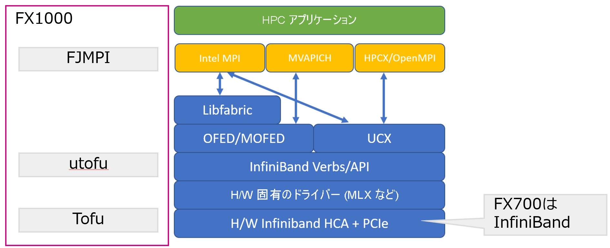

# Decision Diagram型 並列量子シミュレータ　製品要求仕様書

## はじめに・ゴール

私たちの目的は、Decision Diagramを用いた並列量子シミュレータを作成し、顧客が巨大な量子回路を古典コンピュータ上で実行できるようにすることです。

## 誰のためにあるか

1. 富士通シミュレータ顧客: 富士通の共同研究先は、8台のFX700上を用いて36ビットStateVector型シミュレータを使用しています。Decision Diagramによって、より大規模で高速なシミュレータを提供し、顧客のPoCを加速します。

> **Note**
> FX700のCPUはA64FXなので、ARMアーキテクチャに対応する必要があります。共同研究先の東京大学には上位機種のFX1000クラスタがあり、開発にはそれを用います。ただし、FX700にも対応する必要があります

## なぜ作るか

1. 富士通の量子シミュレータ顧客は、より大きな回路のシミュレーションを欲しています！同じ規模の回路はより高速・省メモリに、もっと大きな回路も実行可能にします。
1. Decision Diagram型の量子シミュレータは業界内でも発展途上の分野です。世界に先駆けて大規模並列化された手法やプロダクトを研究開発し、富士通の技術的優位を担保します。

> **Warning**
> 作成するプロダクトは、富士通のA64FXを搭載したマシン上で動作する必要があります。開発しやすさのために、x86_64もサポートすることが望ましいです

## どういうものか？

### 用語集

* Decision Diagram: 決定木。本プロダクトのコア技術。DDの派生としてBDD, ZDD等が挙げられる
* DD: Decision Diagramの略
* QMDD: DDを用いた量子シミュレータの中にはいくつかの方式が存在します。QMDDは最も一般的なものの１つで、今回開発するシミュレータもこれを用います。特徴として、ノードだけでなくエッジにもデータを持ちます。
* 量子シミュレータ: 量子回路を入力として、測定結果をシミュレートして出力するシステム。実際野量子コンピュータではなく、古典コンピュータを用いる

### User Types

* 富士通シミュレータ顧客: 顧客は、システムにSSHを経由してログインします。

### インストール

富士通シミュレータはローカルPyPIサーバを提供しているので、そこにwhlを提供します。

ユーザーは以下のようなコマンドでDDシミュレータをインストールします。

```bash
pip install ddsim
```

### 量子回路の作成

ユーザーはQiskitライブラリを用いて量子回路を作成するものとします。複雑な回路は、Qiskit Transpilerによってシミュレータがサポートするゲート列等に変換されます。

> **Note**
> Qiskitのトランスパイラの実行速度が遅いという問題があり、別のソフトウェアとのベンチマークを取る予定です。結果によってはフロントエンドをQiskit以外に変更します
>
> * Qiskit
> * [tket](https://github.com/CQCL/pytket)
> * [staq](https://github.com/softwareQinc/staq)

### 量子回路のシミュレーション

本プロダクトは、Qiskit Backendに対応するものとします。ユーザーは、作成したQiskitプログラムの数行をDDシミュレータ向けに書き換えるだけで良いです。

> **Note**
> Qiskit Backendに関する情報は[APIドキュメント](https://qiskit.org/documentation/apidoc/providers_models.html)や、富士通シミュレータの[コード例](https://github.labs.fujitsu.com/quantum-computing/qiskit-qulacs/blob/develop/src/qiskit_qulacs/qulacs_backend.py)が参考になります。

## リリース計画

本プロダクトのリリースは数段階に分けて行う予定です

||日時|内容|対象|
|:---:|:---:|:---:|:---:|
|1|FY2022 4Q (Mar. 2023)|ARM対応版（シングルスレッド）|FX700|
|2|FY2023 4Q (Mar. 2024)|大規模並列版|FX700|

## 競合分析

量子シミュレーションにはいくつかの方式が存在する。
|方式|ビット数|ノイズ|利点|欠点|
|:---:|:---:|:---:|:---:|:---:|
|StateVector|35-40|○|複雑ななノイズ・MPI並列化しやすい|1ビット増やすのに2倍のメモリ|
|Decision Diagram|50-100?|×?|省メモリ|ランダム生成回路×|
|Tensor Network|100(IBM), 50(AWS)|×|省メモリ|深い回路×|

## ユーザー獲得戦略

まずは、NDAを結んでいる共同研究先に対して提供します。既に富士通シミュレータを使っているユーザーが初期ユーザーです。

> **Note**
> 本プロダクトのOSS化計画はありません。

## Tech notes

### ベースとするOSS

できれば、本プロダクトは既存のOSSをベースとしてARM対応や並列化対応に集中することが望ましいです。
候補となるOSSは以下の通り

* [DDSim](https://github.com/cda-tum/ddsim)
* [SliQSim](https://github.com/NTU-ALComLab/SliQSim)

大規模並列化に両方とも適さない場合、初めから開発する可能性があります。
その場合、並列化されたBDDパッケージを活用する可能性があります。

* [HermesBDD](https://github.com/luigicapogrosso/HermesBDD)
* [TdZdd](https://github.com/kunisura/TdZdd)
* [Sylvan](https://github.com/utwente-fmt/sylvan)

単にシングルスレッドのBDDパッケージを使う可能性もあります。

* [CUDD](https://github.com/ivmai/cudd)

### 大規模並列化に使用可能なライブラリ

どこまでやるか要検討

* MPI並列化
* MPI/OpenMPハイブリッド並列化
  * MPI化をし、更に各ノード内でOpenMP化すること
  
> **Note**
> 大辻さんからいただいたソフトウェアスタック解説図
> 

## 将来にむけたアイデア

## メンバー

* 量子ソフトPJ 木村悠介 (yusuke-kimura)

## 変更履歴

|日時|担当者|内容|
|:---:|:---:|:---|
|2022/7/7|yusuke-kimura|RDMAやHadoopの利用は現実的ではないことが判明したため、削除|
|2022/7/4|yusuke-kimura|初版|
